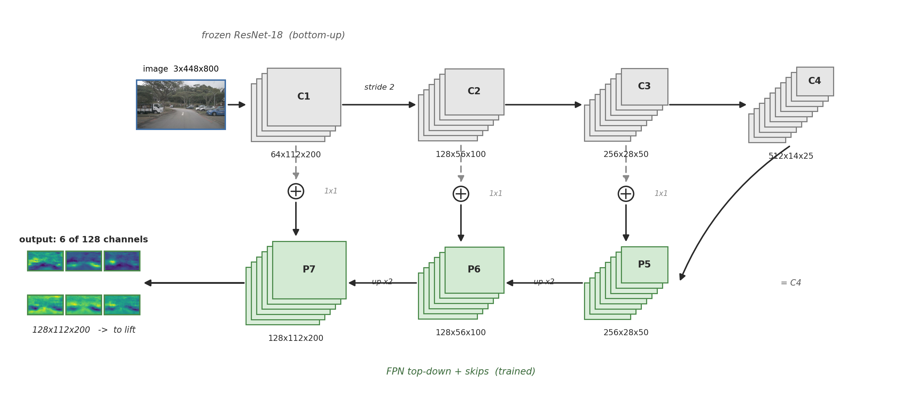
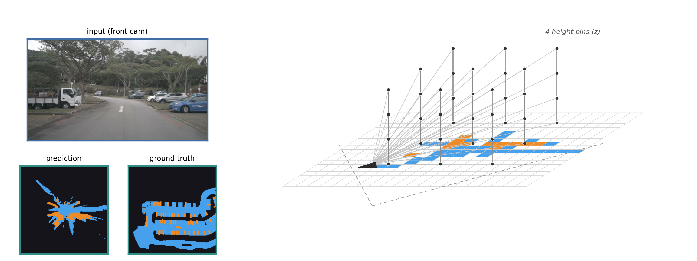
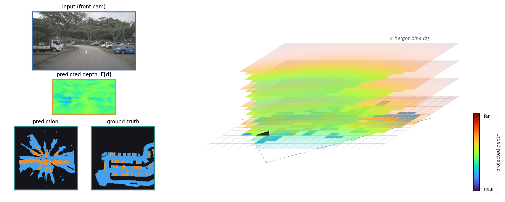
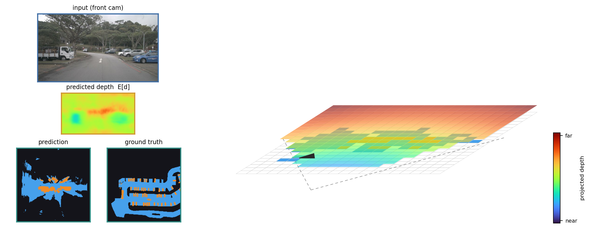
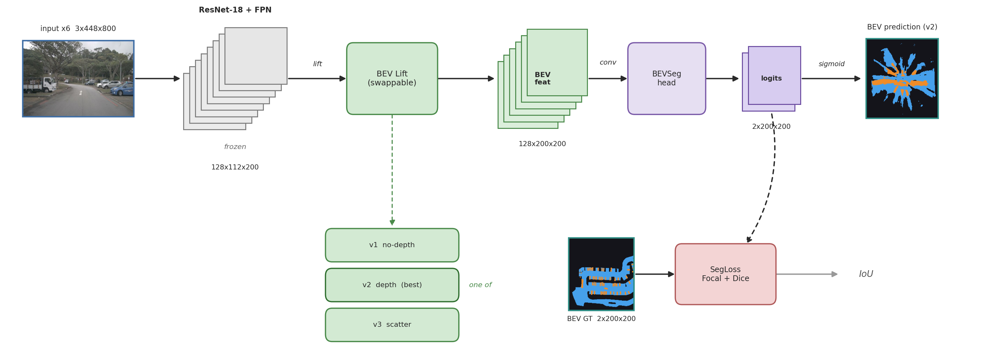

# BEV Perception

An exploration of different ways to fuse image data from multiple cameras into a unified Bird's-Eye View grid representation and use it for downstream tasks like BEV semantic segmentation into drivable areas, vehicles, etc. Each method is trained and evaluated on nuScenes-mini, as a proof-of-concept, with the intent to scale it up to use nuScenes.

## Motivation

Fusing monocular image data from multiple images into a top-down representation is an interesting problem because of the lack of depth information, and thus the need to infer it from context (vehicle/object type, ground contact points etc.). However, it is one of the main methods used for years in autonomous driving (especially before the switch to end-to-end imitation learning methods), and thus it's very educational and informative to explore various ways to go about those issues.

This project explores various of those methods, based on the projection of feature maps in the image space onto the BEV grid, with or without inferred depth information. The different ways of performing this lift onto BEV have a significant impact in the performance and limitations of each method.

## Methods
The core of the project is a sequence of camera to BEV lift variants, each a controlled change targeting a specific limitation of the previous one. Every variant maps a `CameraDataBatch` to a `(B, 128, nx, ny)` BEV feature map and is paired with the same downstream `BEVSeg` head, so swapping the lift holds everything else constant, measuring the difference in performance because of this change. The implementation source code is in `src/bev/models.py`.

### Image preprocessing
The image was downscaled to a resolution of 448x800 with appropriate intrinsics scaling as well, in order to get the memory and compute requirements down to a feasible level for training locally. 

### Backbone: ResNet w/ upsampling with skip connections
In order to produce a feature map for each input image, I used the ImageNet backbone (with a ResNet architecture), with frozen weights, and extended it with a series of FPN-style upsampling layers with skip connections to the ResNet layers of the same stride. That way, the last layer has stride-4, 128-dimensional features, which are then lifted to the BEV grid using the variants described below.

<p align="center"></p>

### Variant 1: no-depth projection lift
`BEVLiftProjection` / `CameraBEVSegProjection`. Projects each BEV grid cell (sampled at a predefined number of fixed heights) into every camera, nearest-samples the image-space (stride-4, not full resolution) features, masks out-of-view cells, takes the average over cameras and sums over heights, with no depth information being used during the lift.

The reasoning behind this approach is similar to the one of BEVFormer (but without attention heads) that the encoder on top of the BEV features would be able to extract depth information for the projected features and de-smear the BEV feature map. However, that would require a deeper encoder head and more data for training, and wasn't effective during my experiments on nuScenes-mini (the output was smeared).

<p align="center"></p>

### Variant 2: learned depth distribution (best on nuScenes-mini)
`BEVLift` / `CameraBEVSeg`, with `FeatureDepthPredictor`. It was designed to mitigate the smearing issue of Variant 1, by estimating a depth distribution (like Lift-Splat-Shoot) through a depth prediction head (MLP) on top of the image-space feature map, that outputs depth probability over D predefined depth bins. Then, using the same predefined-height-set BEV lifting but weighting each feature by the respective linearly-interpolated depth probability, we get a BEV feature map that's less smeared. This accounted for part of the problem of Variant 1, but the nuScenes-mini dataset was too small for the absolute numbers to mean much, and the output map was highly dependent on the predefined set of heights in the BEV, limiting the ability of the model to properly project image features to the correct ground XY coordinates or the horizontal position of vehicles.

<p align="center"></p>

A per-camera video of the learned depth distribution (expected depth beside each input) is in `viz/depth-distribution.mp4`.

### Variant 3: forward scatter (LSS-style)
`CameraBEVForwardScatter` / `CameraBEVSegScatter`. Extending Variant 2 to project the image features and the depth distribution directly to the BEV grid using forward scatter instead of sampling at predefined heights for each cell. Much more computationally expensive (because the forward-scatter optimizations of LSS were not used), and didn't show an improvement over Variant 2 in validation.

<p align="center"></p>

### Loss function
The loss function used for training the architecture end-to-end (input image to segmentation result) was a weighted sum of the focal and Dice loss functions on the per-label segmentation results vs GT. focal loss is per-pixel and heavily weighs uncertain predicted distributions to bring them closer to GT, and Dice loss is region-based and aims to bring the IoU (by optimizing a proxy of it) of the respective segmented regions (per-label) closer to 1.

With logits $z$, per-pixel probability $p=\sigma(z)$, and target $y\in\{0,1\}$, over classes $c$ and pixels $i$:

$$\mathcal{L}_{\text{focal}}=\text{mean}_{c,i}\Big[\,\alpha_c\,(1-p)^{\gamma}\,\big(-\log p\big)\,y+(1-\alpha_c)\,p^{\gamma}\,\big(-\log(1-p)\big)\,(1-y)\,\Big]$$

$$\mathcal{L}_{\text{dice}}=\text{mean}_{c}\left[\,1-\frac{2\sum_i p_{c,i}\,y_{c,i}+\epsilon}{\sum_i p_{c,i}+\sum_i y_{c,i}+\epsilon}\,\right]$$

$$\mathcal{L}=\mathcal{L}_{\text{focal}}+\lambda\,\mathcal{L}_{\text{dice}},\qquad \gamma=2,\ \ \alpha=(0.25,\ 0.5),\ \ \lambda=1,\ \ \epsilon=10^{-5}$$

where $\alpha=(0.25,0.5)$ are the per-class weights for (drivable area, vehicle) — up-weighting the rarer vehicle class.

### Optimization & training
An Adam optimizer was used, with a learning rate of 1e-4, betas (0.9, 0.999), eps 1e-8, and weight decay 1e-12, together with gradient-norm clipping at 1.0. The batch size was 2 for variants 1 and 2, and 1 for forward scatter (which is more memory-hungry). The models were trained on nuScenes mini-train (323 keyframes) and evaluated on mini-val (81 keyframes). Training ran for up to 15 epochs, extended toward 50 while the validation loss kept dropping, with a patience-based (patience of 5 epochs) early-stopping mechanism on the validation loss. Only the FPN upsampling layers, the depth predictor (variants 2–3), and the BEV segmentation head are trained — the ResNet-18 backbone stays frozen with its BatchNorm in eval — and the lowest-validation-loss checkpoint is kept as `best.pt` (no-depth best at epoch 9, learned-depth at 5, forward-scatter at 11). The training loop lives in `scripts/warmup.py` (driven by `scripts/run_warmups.sh`).

## Combined architecture

<p align="center"></p>

BEV grid: `BEVGridSpec` at ±50 m, 0.5 m resolution → 200×200, layers `drivable_area`, `vehicle`. Depth bins D=42 over 0–42 m; height slices at −0.5–3.0 m (4 slices).

Key modules:

| Component | File / symbol |
| --- | --- |
| Keyframe reader, `CameraDataBatch`, `collate_fn` | `src/bev/data/nuscenes_dataset.py` |
| Backbone (frozen ResNet-18 + FPN, BN in eval) | `src/bev/models.py::ResNetBackbone` |
| Depth predictor | `src/bev/models.py::FeatureDepthPredictor` |
| Lift v1 / v2 / v3 | `BEVLiftProjection` / `BEVLift` / `CameraBEVForwardScatter` |
| Seg wrappers (lift + head) | `CameraBEVSegProjection` / `CameraBEVSeg` / `CameraBEVSegScatter` |
| Seg head | `src/bev/models.py::BEVSeg` |
| Loss | `src/bev/models.py::SegLoss` (`FocalLoss` + `DiceLoss`) |
| BEV grid spec + raster store | `src/bev/raster.py` |
| BEV ground-truth rasterizer (map + 3D boxes → grid) | `scripts/rasterize_bev.py` |
| Training loop (frozen-backbone warmup) | `scripts/warmup.py` |
| Prediction-vs-GT viz + comparison video | `src/bev/viz/predictions.py`, `scripts/make_comparison_video.py` |
| Calibration checks | `scripts/inspect_sample.py`, `scripts/check_lift_directions.py` |

Deliberately delegated / standard components: ImageNet-pretrained ResNet-18 backbone weights (frozen, BN kept in eval), nuScenes devkit for parsing and map masks.

## Results

Trained on nuScenes-mini for pipeline validation and fast iteration, computing and reporting the per-class IoU on the validation set for each method.

| Lift variant | Drivable IoU | Vehicle IoU |
| --- | --- | --- |
| v1 — projection (no depth) | 0.340 | 0.091 |
| v2 — learned depth | **0.390** | **0.141** |
| v3 — forward scatter | 0.373 | 0.118 |

<sub>Micro IoU (Σ intersection / Σ union across frames) on `mini_val` — 81 keyframes, threshold 0.5, best checkpoints. Reproduce: `scripts/eval_iou.py --split mini_val --store data/bev_rasters/mini_val`.</sub>

Looking at those results, it is obvious how learning the depth distribution in the image space was very valuable downstream in BEV segmentation, especially for vehicles that occupy a smaller area in the BEV grid and thus smearing affects their IoU more, and it's harder for the segmentation head to disambiguate smearing from the legitimate occupied area. Forward scatter did not beat the learned depth distribution, and it was also much slower to run due to the lack of LSS's optimizations in the scatter.

Qualitative outputs:
- `viz/mini-comparison.mp4` — top-down GT vs. all three models across the mini scenes.
- `viz/depth-distribution.mp4` — variant 2's learned depth (expected depth per surround camera).
- `viz/warmup-best-comparison.png` — best-epoch prediction montage per variant.
- `viz/warmup-loss-curves.png` — training/val loss curves.

## Roadmap

- Full nuScenes `trainval` beyond mini (pipeline already supports it — see `scripts/rasterize_bev.py` / `scripts/warmup.py` with the `trainval` splits).
- Attention-based lift (BEVFormer-style).
- Lidar fusion into the BEV grid.
- Temporal fusion.

## How to run

Environment:

```bash
python3 -m venv --system-site-packages .venv   # reuses the system torch build
.venv/bin/pip install -r requirements.txt      # torch/torchvision expected from the env
```

Data (nuScenes-mini, ~4.2 GB compressed, no login required):

```bash
./scripts/download_nuscenes.sh data/nuscenes
```

Full `trainval` needs an account (<https://www.nuscenes.org/nuscenes#download>); extract into the same dataroot. `data/` is gitignored.

Verify the loader / calibration before trusting anything downstream:

```bash
PYTHONPATH=src .venv/bin/python scripts/inspect_sample.py \
    --dataroot data/nuscenes --lidar --out out/sample.png
.venv/bin/python -m pytest tests/ -q     # runs against a synthetic nuScenes tree
```

Rasterize BEV ground truth (map + 3D boxes → grid), per split:

```bash
.venv/bin/python scripts/rasterize_bev.py --version v1.0-mini --split mini_train \
    --out data/bev_rasters/mini_train
.venv/bin/python scripts/rasterize_bev.py --version v1.0-mini --split mini_val \
    --out data/bev_rasters/mini_val
```

Train (frozen-backbone warmup; `--model` selects the lift variant):

```bash
.venv/bin/python scripts/warmup.py --model nodepth --train-batch 2 \
    --version v1.0-mini --train-split mini_train --val-split mini_val \
    --train-raster data/bev_rasters/mini_train --val-raster data/bev_rasters/mini_val
# --model {nodepth, depth, scatter}; see scripts/run_warmups.sh for the full sweep.
```

Checkpoints land in `models/warmup-<model>/best.pt`; per-epoch montages in `viz/warmup-<model>/`.

Comparison video (top-down GT vs. all three best checkpoints over the mini scenes):

```bash
.venv/bin/python scripts/make_comparison_video.py --out viz/mini-comparison.mp4 --fps 4
```

Evaluate per-class IoU (fills the results table above):

```bash
.venv/bin/python scripts/eval_iou.py --split mini_val --store data/bev_rasters/mini_val
```

## Layout

```
src/bev/data/nuscenes_dataset.py   keyframe reader: images + lidar + raw calibration, collate
src/bev/models.py                  backbone, lift variants, seg head, losses
src/bev/raster.py                  BEV grid spec + raster store
src/bev/viz/                       prediction-vs-GT rendering
scripts/rasterize_bev.py           precompute BEV ground-truth rasters
scripts/warmup.py                  frozen-backbone training for one lift variant
scripts/make_comparison_video.py   top-down GT-vs-models comparison video
scripts/eval_iou.py                per-class BEV IoU for the warmup checkpoints
tests/                             synthetic fixture + loader tests
```
